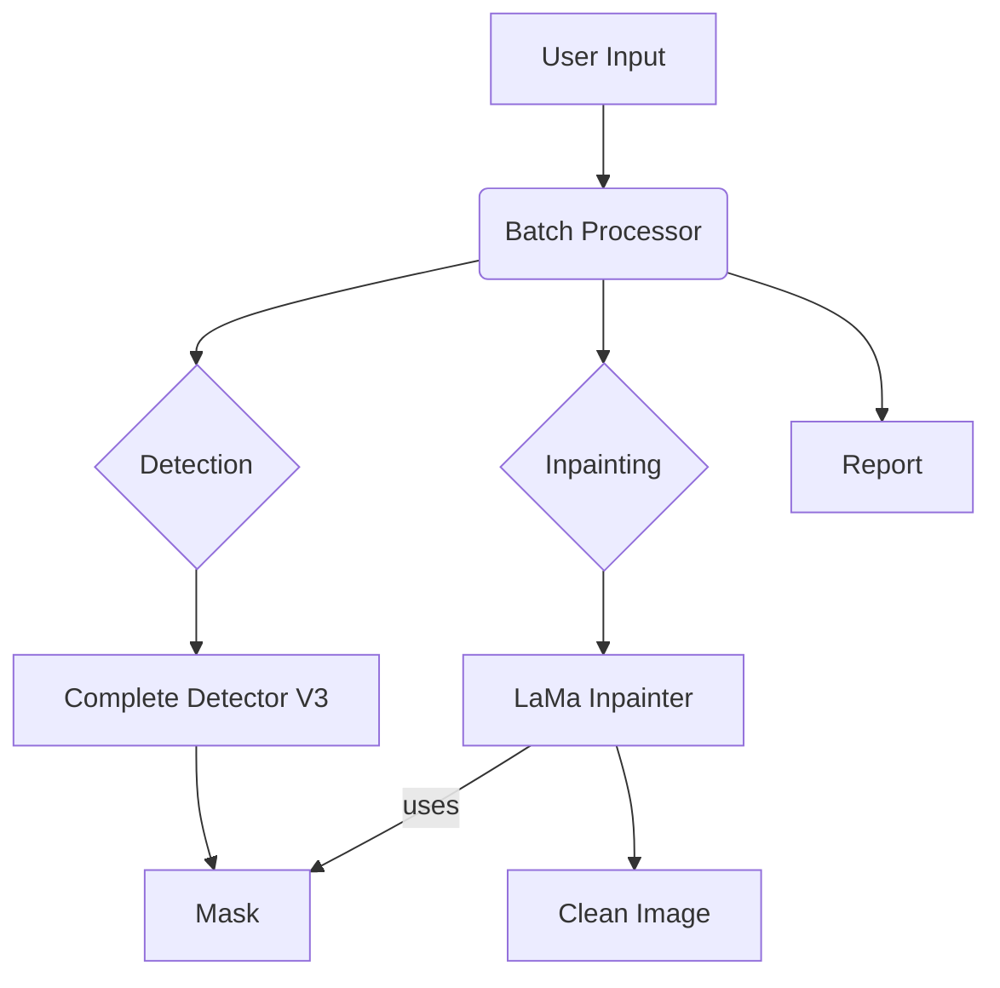

# Architecture

This document provides a detailed overview of the technical architecture of the Watermark Remover tool.

## Core Components

The system is composed of three main components:

1.  **Batch Processor (`batch_processor.py`)**: The main entry point and orchestrator.
2.  **Complete Watermark Detector (`complete_watermark_detector.py`)**: The V3 high-precision detection module.
3.  **LaMa Inpainter (`lama_inpainter.py`)**: The deep learning inpainting module.

### 1. Batch Processor

**Responsibilities**:
- **Command-Line Interface**: Parses user arguments (`--input`, `--output`, `--batch`, etc.).
- **File Discovery**: Scans input directories for image files.
- **Orchestration**: For each image, it calls the detector and then the inpainter.
- **Reporting**: Aggregates results and generates a JSON report and a file list.
- **Error Handling**: Catches and logs errors for individual files without halting the entire batch.

### 2. Complete Watermark Detector (V3)

This is the core innovation of the project, designed to achieve 100% watermark coverage.

**Detection Pipeline**:

1.  **Search Region Identification**: Isolates the bottom-right corner of the image to reduce the search space and prevent false positives.
2.  **Color-Based Thresholding**: Creates an initial binary mask of all pixels matching the watermark's dark gray color profile.
3.  **Contour Analysis**: Finds all distinct shapes (contours) in the binary mask.
4.  **Shape & Size Filtering**: Filters contours based on expected width, height, and aspect ratio to identify the primary watermark component.
5.  **Three-Stage Coverage Expansion**:
    - **Method 1 (Direct)**: Re-analyzes the area within the detected bounding box to ensure all color-matching pixels are included.
    - **Method 2 (Expanded)**: Searches a slightly larger region to capture faint edges.
    - **Method 3 (Global)**: Validates that all detected components are part of the same watermark structure.
6.  **Mask Merging**: Combines the results of all three methods into a single, comprehensive mask.
7.  **Final Refinement**: Applies a slight dilation and Gaussian blur to smooth edges and close any microscopic gaps, preparing the mask for the inpainting model.

### 3. LaMa Inpainter

**Responsibilities**:
- **Model Loading**: Initializes the LaMa model and handles device placement (CPU, CUDA, MPS).
- **Image Preprocessing**: Prepares the input image and mask for the model.
- **Inpainting**: Executes the LaMa model to fill the masked region.
- **Image Postprocessing**: Converts the output tensor back into a standard image format (Pillow Image).

**Underlying Library**: `simple-lama-inpainting`

This library provides a high-level wrapper around the official LaMa implementation, simplifying the model download, caching, and execution process.

## Data Flow

The data flows through the system as follows:

1.  **Input**: The user provides an input directory of images.
2.  **Processing Loop**: The `Batch Processor` iterates through each image.
3.  **Detection**: The `CompleteWatermarkDetector` takes an image path and returns a NumPy array representing the binary mask (255 for watermark, 0 for background).
4.  **Inpainting**: The `LamaInpainter` takes the original image path and the generated mask, and returns a Pillow Image object of the clean image.
5.  **Output**: The `Batch Processor` saves the clean image to the output directory and records the results.
6.  **Reporting**: After the loop, the `Batch Processor` compiles all results into a JSON report.

## Design Principles

- **Modularity**: Each component is self-contained and can be tested or replaced independently.
- **Robustness**: The batch processor is designed to handle errors gracefully, ensuring that one failed image does not stop the entire process.
- **Precision**: The V3 detector was built with the single goal of achieving 100% mask coverage to eliminate any post-processing requirements.
- **Usability**: The command-line interface is designed to be intuitive, with clear arguments and helpful examples.
